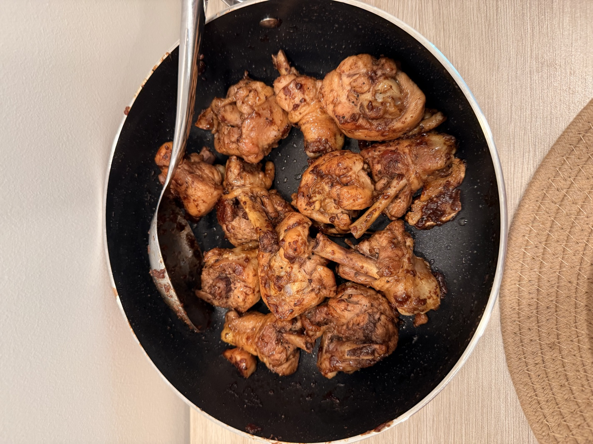

# Adobo on Island Time

**Filipino roots. Hawaiʻi raised. Made with aloha.**

A personal cooking journal by Justine Afaga, bringing together two things I love: making chicken adobo and building with code. No assignment, no deadline—just a project for fun.

[Editing guide](EDITING.md) · [Deployment guide](VERCEL.md) · [Photo credits](PHOTO_CREDITS.md)

<p align="center">
  
  <br />
  <em>My recipe. My actual finished batch.</em>
</p>

## Explore the recipe

Follow six cooking moments, from prepping the chicken to serving the finished dish. Hover over a timeline photo, then click to zoom into the directions, ingredients, cooking cues, and personal notes.

- Animated timeline with previous/next navigation and completion tracking.
- Responsive layouts for desktop, tablet, and phone.
- Keyboard navigation, focus restoration, and reduced-motion support.
- My two-shoyu recipe: Aloha Original, Silver Swan Special, ginger, and an oyster-sauce finish.

## Built with

**React 19 · TypeScript · Vinext / Vite · Tailwind CSS · Base UI · Web Animations API**

Recipe content, image data, and animation geometry are separate from the page layout. Completion tracking stays in browser memory for the session. The Vercel build exports static HTML and an interactive React bundle; no database or application server is required.

## Run locally

Use Node.js 22.13 or newer.

```sh
npm ci
npm run dev
```

Open the local URL printed in your terminal.

```sh
npm run check          # lint, TypeScript, and automated tests
npm run build:vercel   # static export for Vercel
npm run build          # existing Sites / Cloudflare build
```

## Make it your own

The source includes searchable `EDIT SECTION`, `EDIT STEP`, and `EDIT STYLE` comments.

| Change                          | File                                                         |
| ------------------------------- | ------------------------------------------------------------ |
| Recipe steps and ingredients    | [lib/recipe.ts](lib/recipe.ts)                               |
| Photos, crops, and credits      | [lib/site-media.ts](lib/site-media.ts)                       |
| Page sections and interactions  | [components/adobo-journal.tsx](components/adobo-journal.tsx) |
| Colors, typography, and layouts | [app/globals.css](app/globals.css)                           |
| Timeline zoom geometry          | [lib/timeline-motion.ts](lib/timeline-motion.ts)             |

See [EDITING.md](EDITING.md) for the full guide and [VERCEL.md](VERCEL.md) for deployment settings. Automated checks cover recipe consistency, image files and attribution, and zoom geometry.

## Credits

Recipe, personal story, and finished-dish photo by **Justine Afaga**. Ingredient images and the remaining cooking reference photo are documented in [PHOTO_CREDITS.md](PHOTO_CREDITS.md). The recipe includes linked USDA guidance for safer chicken preparation.
