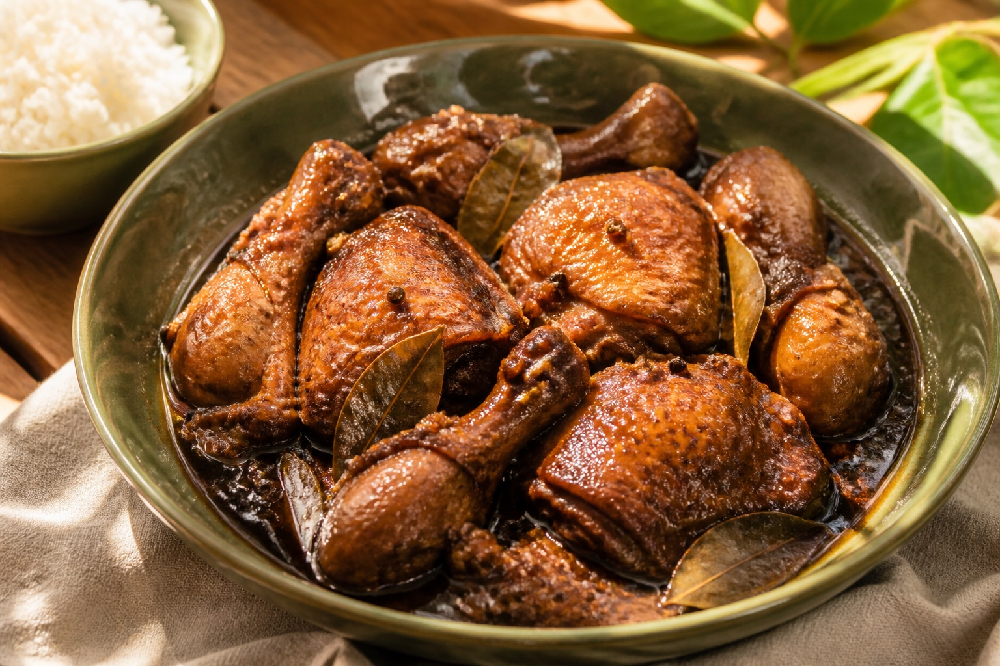

# Adobo on Island Time

A personal cooking journal about chicken adobo, Filipino roots, and growing up in Hawaiʻi. Built for fun, with the care of a software project.

**[Private website preview](https://adobo-on-island-time.afagajustine.chatgpt.site)** · [Repository](https://github.com/Jafaga/adobo-on-island-time)



## The experience

Six clickable cooking milestones follow an estimated 90-minute journey. The desktop timeline alternates above and below a central line, inspired by a project schedule. Tablets retain the horizontal axis with scrolling; phones use a vertical timeline. The timeline is the first screen, with circular milestones instead of cards. Hover brings a milestone forward. Clicking it expands from its actual screen position into a spacious cooking view, with ingredients, instructions, sensory cues, and a kitchen note. Closing reverses the animation into the originating milestone.

- Previous/next navigation, per-session completion state, and explicit undo.
- Keyboard access (Tab, arrow keys, Home/End, Enter), focus restoration, escape-to-close, a skip link, and descriptive step labels.
- CSS hover motion and Web Animations API zoom transitions, with a pure, tested geometry calculation. Reduced-motion preferences bypass spatial animation.
- An ingredient list, personal introduction, and a short explanation of the build.

## Make the recipe yours

The displayed recipe is **a clearly labeled starter**, not Justine's final personal recipe. No personal cooking traditions or family memories have been invented. The lead photo is an AI-created illustration.

Edit `lib/recipe.ts` to supply your exact ingredient amounts, durations, instructions, cues, and tips. Elapsed times and the total duration are computed from the step data. Update the starter notice in `components/adobo-journal.tsx` once your recipe is finalized. Replace `public/chicken-adobo.jpg` with your own cooking photograph and update its alt text and caption.

The current UI is intentionally composed for six milestones. If adding steps, also update its icon list, step-count labels, and timeline layout.

## Run locally

Node.js 22.13 or newer is required.

```sh
npm ci
npm run dev
```

Open the Local URL printed in the terminal. The development server stays local; deployment is a separate operation.

```sh
npm run check   # lint, TypeScript, recipe invariants
npm run build   # production Cloudflare Worker + client assets
```

CI runs the same checks on pushes to `main` and on pull requests.

## Engineering notes

React 19 and TypeScript power the interface. Vinext runs the App Router application on Vite, and the Sites plugin packages it for Cloudflare Workers. The expanded cooking view uses the installed shadcn/Base UI Dialog primitive for modal semantics and focus management. A measured transform maps the expanded view to the clicked circle, so it grows from that position and returns there on close. Recipe data and elapsed-time calculations live separately from presentation.

There is no database, analytics, account system inside the app, or third-party API dependency. Completion state stays in React memory for the current page session and resets on reload. The private preview's access is enforced by the hosting platform.

- `app/page.tsx` — route entry point
- `components/adobo-journal.tsx` — journal and interactive step panels
- `lib/recipe.ts` — typed starter recipe and time calculations
- `lib/timeline-motion.ts` — pure geometry for the zoom transition
- `app/globals.css` — responsive layout, palette, typography, and motion
- `tests/recipe.test.mjs` — timeline continuity, time formatting, and content integrity
- `tests/timeline-motion.test.mjs` — zoom coordinates across screen sizes and degenerate frames
- `.github/workflows/ci.yml` — repeatable automated checks

The generated component catalog in `components/ui` and its `use-mobile` hook are retained unchanged. Lint excludes that vendored starter catalog because it includes upstream lint violations; TypeScript still checks it. Application code remains under the strict starter lint rules.

## Recipe and image credits

The starter recipe is an original synthesis informed by [Vanjo Merano](https://panlasangpinoy.com/filipino-chicken-adobo-recipe/) and [Lalaine Manalo](https://www.kawalingpinoy.com/chicken-adobo/). Poultry handling and reused-marinade guidance follows [USDA](https://www.fsis.usda.gov/food-safety/safe-food-handling-and-preparation/food-safety-basics/grilling-and-food-safety). Chicken must reach 165°F / 74°C; times are estimates and never replace a thermometer.

The food illustration was generated specifically for this project. It does not depict Justine's actual finished dish. The supplied schedule screenshot guided the timeline layout and is not redistributed here.

## Validation

Automated checks cover static analysis, type safety, recipe-data integrity, and the production build. A local HTTP request verifies the route renders. Full browser interaction and visual testing has not yet been performed.
